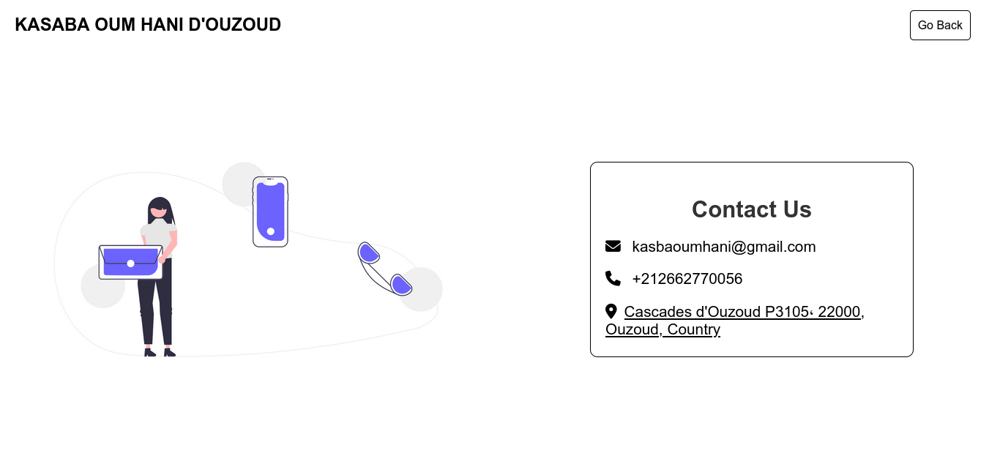

# HOME PAGE

# CONTACT US PAGE

# Project Title: Kasba Oum Hani d'Ouzoud Webpage

## Description

This project is a visually appealing and informative webpage dedicated to Kasba Oum Hani d'Ouzoud, a historical landmark in Morocco. It is built using HTML, CSS, and Bootstrap, providing visitors with a captivating exploration of the Kasba's rich history, architectural significance, and cultural importance.

## Technologies Used

- HTML: The foundation for structuring the webpage's content and elements.
- CSS: Responsible for styling the webpage's visual appearance, including layout, fonts, colors, and animations.
- Bootstrap: A powerful CSS framework that streamlines the development process by providing pre-built components and responsive design features.

## Features

- Engaging Content: The webpage incorporates captivating text, images, and potentially even videos to immerse visitors in the history and beauty of Kasba Oum Hani d'Ouzoud.
- Intuitive Navigation: A clear and user-friendly navigation system allows visitors to effortlessly explore different sections of the webpage, such as the Kasba's history, architecture, cultural significance, and perhaps even a photo gallery or visitor information.
- Responsive Design: The webpage is built with responsiveness in mind, ensuring optimal viewing and interaction across various devices, from desktops and laptops to tablets and smartphones. (Bootstrap's grid system and utility classes are instrumental in achieving this.)

## Getting Started

1. Clone the Repository: Use Git to clone this repository onto your local machine. You'll find instructions on how to do this in the [GitHub documentation](https://github.com/YASSINTAGHI/Hotel_landing_page.git).
2. Open the Project in a Code Editor: Once cloned, open the project directory in your preferred code editor (e.g., Visual Studio Code, Sublime Text, Atom).
3. Run a Local Server (Optional): If you'd like to preview the webpage in your browser before deploying it online, you can set up a local development server using tools like Live Server or Python's built-in http.server module. Instructions for these can be found online.
4. View the Webpage: In your browser, navigate to the `http://localhost:<port number>` address (the port number will vary depending on your local server setup).
